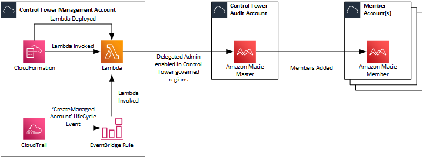

# Amazon Macie

This CloudFormation Template configures a Lambda Function that leverages parameters parsed into it via CloudFormation Parameter through the use of Environment Variables.  Specifically the Lambda Function does a number of things:
* Determines whether a Delegated Administrative Account exists for Amazon Macie.  If it doesn't then it enables Delegated Administration to the AWS Account ID that is parsed in.
* For every Governed Region within AWS Control Tower and every Active AWS Account in the Organization, it then assumes the AWSControlTowerExecution Role and Enables Amazon Macie
* For every Governed Region within AWS Control Tower it then assumes the AWSControlTowerExecution Role into the Delegated Adminstration Account and Adds all Active AWS Accounts within the Organization as Members.
* If the CloudFormation Stack is deleted, it disables Amazon Macie in every AWS Account and then deregisters the Delegated Administration.

## Architecture Overview



## Pre-Requisites and Installation

### Pre-Requisites

There is an overarching assumption that you already have [Customisation for Control Tower](https://aws.amazon.com/solutions/implementations/customizations-for-aws-control-tower/) deployed within your Control Tower Environment.

1.  Clone the GitHub Repo to your local device.
2.  Create an S3 Bucket where you'll then upload the `macie.zip` file to. Make a note of the bucket name and the prefix to the `macie.zip`. Note: The region where you create the bucket will need to be in the region of the Control Tower home region since that is where the Lambda Function will be created.
3.  Create a prefix within the S3 Bucket named `lambda-layers` and upload `cfnresponse.zip`to that prefix.

### Installation

1.  Copy the CloudFormation Template `enable-macie.yaml` should be added to the `/templates` folder for use with Customisations for Control Tower.
2.  Copy the CloudFormation Parameters `enable-macie.json` should be added to `/parameters` folder for use with Customisations for Control Tower.
3.  Update the CloudFormation Parameters `enable-macie.json` with the required details:
    * **OrganizationId:** This is used to implement conditions within the IAM Policy used for the Lambda Execution Role. This can be obtained from with AWS Organisations.
    * **MacieMasterAccountId:** This is the AWS Account ID of the Account that you wish to configure as the delegated admin for Access Analyser.  It's recommended to use the Security Account (formerly called Audit Account) configured by Control Tower.
    * **S3SourceBucket:** This is the S3 Bucket where the Lambda Function source files are located.
    * **S3Key:** This is the prefix within the S3 Bucket where the Lambda Function source files are located.
    * **RoleToAssume:** This is used within the Lambda Function to AssumeRole into other AWS Accounts in order to Create/Configure/Delete different AWS Services such as Security Hub.  This is preconfigured with a default value of `AWSControlTowerExecution` since this IAM Role is created in all AWS Accounts as part the AWS Control Tower setup.

    The above values should be configured within the `enable-macie.json`:

    ```json
    [
        {
            "ParameterKey": "OrganizationId",
            "ParameterValue": ""
        },
        {
            "ParameterKey": "MacieMasterAccountId",
            "ParameterValue": ""
        },
        {
            "ParameterKey": "S3SourceBucket",
            "ParameterValue": ""
        },
        {
            "ParameterKey": "S3Key",
            "ParameterValue": ""
        },
        {
            "ParameterKey": "RoleToAssume",
            "ParameterValue": "AWSControlTowerExecution"
        }
    ]
    ```

4.  Update the `manifest.yaml` and configure the `deployment_targets` and `regions` accordingly based on your needs. The deployment target should be the AWS Control Tower Management Account since the Lambda Function that is invoked uses API Calls that are run are only available to the Master Account whilst the region should be configured to the Control Tower home region.

    ```yaml
    - name: Enable-Amazon-Macie
      description: "CloudFormation Template to Enable Amazon Macie for the Organization"
      resource_file: templates/enable-macie.yaml
      parameter_file: parameters/enable-macie.json
      deploy_method: stack_set
      deployment_targets:
        accounts:
          - # Either the 12-digit Account ID or the Logical Name for the Control Tower Management Account
      regions:
        - # AWS Region that is configured as the Home Region within Control Tower
    ```